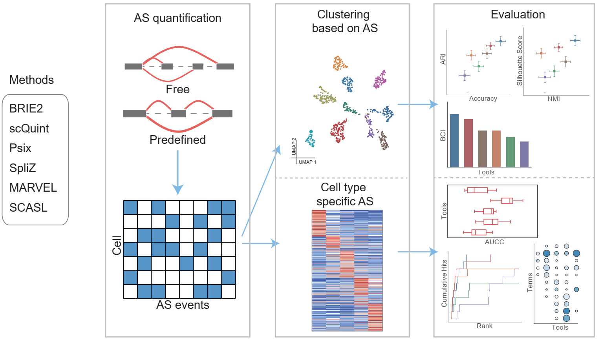

# Comprehensive Assessment of Alternative Splicing Analysis Methods for Single-cell RNA-seq

This repository provides a comprehensive benchmarking framework for evaluating computational methods designed to analyze alternative splicing (AS) in single-cell transcriptomes. We systematically benchmarked six single-cell AS analysis methods—**BRIE2, scQuint, Psix, SpliZ, MARVEL, and SCASL**—to evaluate:

- **Clustering performance** using splicing features.
- **Differential alternative splicing event (DASE) detection**, including agreement with bulk RNA-seq.
- **Scalability** (runtime and peak memory) from mapped reads to splicing matrices.

---

## Evaluation Framework

### Clustering Metrics
- **Accuracy**: Proportion of correctly predicted cells.
- **ARI**: Adjusted Rand Index for label concordance.
- **NMI**: Normalized Mutual Information.
- **Silhouette Score**: Cohesion and separation of clusters.
- **BCI Score**: Average of accuracy, ARI, NMI, and silhouette scores.

### DASE Detection
- **AUCC**: Area under the concordance curve for single-cell vs bulk results.
- **Cumulative Recall**: Recovery of experimentally validated splicing events.
- **GO Enrichment**: Functional relevance of top-ranked splicing events.

### Scalability
- Computational time and memory usage for generating splicing profiles.

---

## Datasets

### Clustering Evaluation 
- **Camp et al., 2017** — iPSC → hepatocyte differentiation
- **Wang et al., 2021** — primary colorectal cancer
- **Tabula Muris, 2018** — kidney tissue
- **Zhang et al., 2019** — HCC-infiltrating lymphocytes (donor D20170327)
- **Tasic et al., 2018** — 10 neocortical cell types (random subset)

### DASE Evaluation
- **Trapnell et al., 2014** — skeletal myoblast differentiation (0h, 24h, 48h, 72h)
- **Song et al., 2017** — iPSC vs motor neurons
- **Aleksandra et al., 2015** — mouse ESC in serum vs a2i

---

## Dependencies and Requirements

### Environment

- Python ≥ 3.8  
- R ≥ 4.1  
- Miniconda for environment management ([download here](https://docs.conda.io/en/latest/miniconda.html))

You can find the environment files in the repository:  
[https://github.com/QuanlongJiang/scAS_Benchmarking/env/*.yml](https://github.com/QuanlongJiang/scAS_Benchmarking/env/*env.yml)

---

### Example: Building the Environment for BRIE2

1. Build isolated environment for BRIE2: `conda env create -f brie2.yml`

2. Activate the Python environment: `conda activate brie2`

> **Note:** Installation of the benchmarking dependencies may take about 10-15 minutes.

### Single-cell AS Methods
- **BRIE2** — docs: [https://brie.readthedocs.io/en/latest/index.html](https://brie.readthedocs.io/en/latest/index.html)
- **scQuint** — GitHub: [https://github.com/songlab-cal/scquint](https://github.com/songlab-cal/scquint)
- **Psix** — GitHub: [https://github.com/lareaulab/psix](https://github.com/lareaulab/psix)
- **SpliZ** — GitHub: [https://github.com/salzman-lab/SpliZ](https://github.com/salzman-lab/SpliZ)  
  (Inputs via SICILIAN: [https://github.com/salzman-lab/SICILIAN/](https://github.com/salzman-lab/SICILIAN/))
- **MARVEL** — docs: [https://wenweixiong.github.io/MARVEL_Plate.html](https://wenweixiong.github.io/MARVEL_Plate.html)
- **SCASL** — GitHub: [https://github.com/xryanglab/SCASL](https://github.com/xryanglab/SCASL)

### Bulk AS Methods
- **rMATS-turbo v4.3.0** — [https://github.com/Xinglab/rmats-turbo](https://github.com/Xinglab/rmats-turbo)
- **LeafCutter** — [https://davidaknowles.github.io/leafcutter/](https://davidaknowles.github.io/leafcutter/)

---

## Tutorial and Usage

Tutorials for running clustering, AUCC calculation, method comparison, and pipelines for each tool are available in the corresponding subfolders under `scAS_Benchmarking/code/`.
